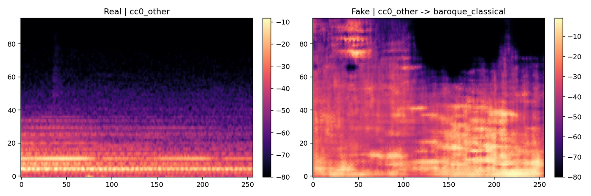
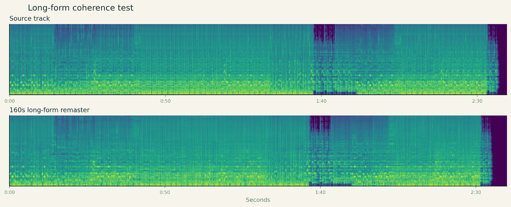
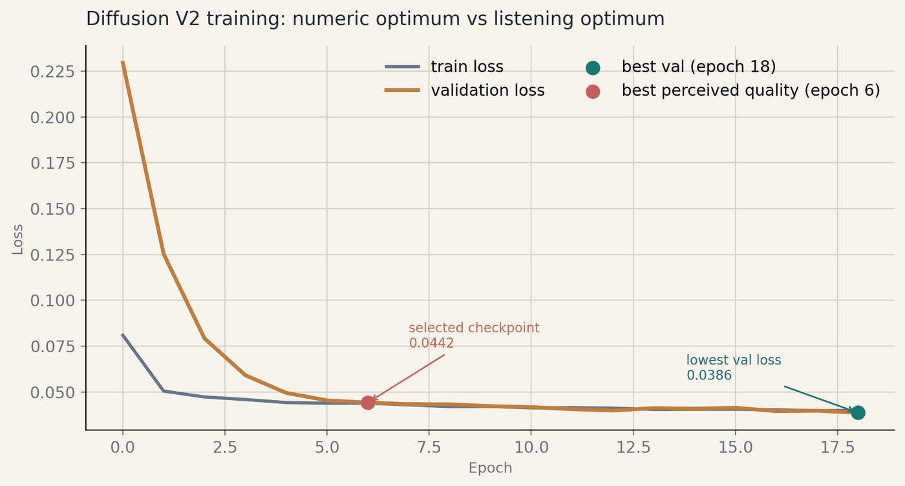

# Deep Generative Genre Remastering (DGGR)

**A four-stage audio pipeline that separates a track into content and style, calibrates a 160-D
genre space, and rebuilds the track in a target genre. Every stage is gated on numeric thresholds
that were written into the project proposal before any model was trained.**



*Left: a `cc0_other` clip. Right: the codec track's remaster of it into `baroque_classical`.
Figures in this README come from the project's [final report](DGGR-final-report.pdf).*

**Read** the [final report, 15 pp](DGGR-final-report.pdf) · the [proposal, carrying the
pre-registered targets](DGGR-proposal.pdf) · [hear the outputs](examples/README.md)

```bash
python -m pip install -r requirements.txt
cp .env.example .env                          # set DGGR_DATA_ROOT and DGGR_MANIFESTS_ROOT
python "lab 3/run_lab4_longform_coherence.py" \
  --source-audio path/to/track.mp3 --source-seconds 8 \
  --out-dir saves2/lab4_longform_coherence/demo
```

That last command remasters the first 8 seconds of a track into `baroque_classical` and writes
`coherence_metrics.json` beside the audio. It reads its checkpoint from
`saves2/lab3_diffusion/run_d002/checkpoints/epoch_006.pt` by default, and neither that file nor the
training corpora are in the repository — it ships the code, the report, and a few sample clips. The
recipes that produced each best checkpoint are in
[`docs/howto/reproduce_best_runs.md`](docs/howto/reproduce_best_runs.md).

---

## The four stages

Four notebooks, four library modules. Each stage consumes the one above it.

1. **Deconstruction.** An encoder splits a track into a 128-D content vector and a 128-D style
   vector under an adversarial style probe, with a music/non-music gate. Audited on style-probe
   accuracy, content leakage above baseline, and gate ROC-AUC.
2. **Target space.** Style vectors from four corpora are concatenated with 32 handcrafted
   descriptors into a 160-D target vector, and per-genre centroids become the conditioning
   blueprint. Audited on silhouette, linear probe, and nearest-centroid accuracy.
3. **Synthesis.** Two parallel tracks. A codec track translates frozen EnCodec latents, conditioned
   on a target style centroid, and decodes straight to waveform. A diffusion track generates
   log-mel with v-prediction and vocodes with BigVGAN. Both are scored on melodic preservation,
   target-style confidence, and spectral continuity.
4. **Long-form.** Chunked SDEdit-style remastering of a whole track, with prefix-overlap locking and
   periodic re-anchoring, measured on boundary mel MSE and discontinuity between chunks.

## Measured against targets fixed before training

The [proposal](DGGR-proposal.pdf) sets every threshold on 2026-02-10; none of them moved after the
results came in.

| Stage | Metric | Target | Achieved |
|---|---|---|---|
| Deconstruction | style-probe accuracy | ≥ 0.85 | **0.9417** |
| Deconstruction | content leakage above baseline | ≤ 0.15 | **0.1083** |
| Deconstruction | music-gate ROC-AUC | ≥ 0.90 | **0.9299** |
| Target space | silhouette (cosine) | ≥ 0.45 | **0.4939** |
| Synthesis (codec) | melodic preservation | ≥ 0.90 | **0.9565** |
| Synthesis (codec) | target-style confidence | ≥ 0.85 | **0.8940** |

Leakage is the content probe's accuracy above the 0.500 chance baseline, and it is the number that
matters most here — it says style and content came apart rather than the encoder memorising both.



## Why it is hard

Genre and dataset source are the same variable in every public corpus in this project. XTC hip-hop,
FMA lo-fi, and PD-symbolic baroque come from different collections, so a model that appears to
transfer style can be learning one source's recording chain instead. The pipeline fights that with
grouped train/val splits on track ID, multi-source genre buckets with balanced sampling, a leakage
audit that re-derives labels from audio instead of trusting the corpus, and a style judge built on
MERT embeddings. The other hard part is length: chunked diffusion drifts, so the long-form path
locks each chunk's prefix to the previous chunk's tail in the mel domain and re-anchors every few
chunks.

## What you can do in it

- **Remaster a short clip into any of four genres** — baroque classical, hip-hop, lo-fi, or an
  "other" bucket — with the codec track, the stronger of the two synthesis paths.
- **Hear results without running anything.** Three codec transfers and four diffusion samples are
  committed under [`examples/audio/`](examples/audio), with the producing run and checkpoint
  recorded in [`examples/metadata.md`](examples/metadata.md).
- Remaster a whole track with the long-form path and get `coherence_metrics.json` next to the audio.
- Audit a run for source leakage with `run_lab3_quality_audit.py`, which reports where a model is
  keying on the corpus rather than the style.
- Reproduce a headline number from the checkpoint paths listed in
  [`docs/explanation/results.md`](docs/explanation/results.md).

## Where to look in the code

| Area | Path |
|---|---|
| Deconstruction encoder | `notebooks/01_lab1_deconstruction_encoder.ipynb` |
| Target-vector space (Lab 2) | `dggr/lab2_pipeline.py` |
| Codec-latent transfer (Lab 3) | `dggr/lab3_codec_train.py`, `lab 3/run_lab3_codec.py` |
| Style judge and gate metrics | `dggr/lab3_codec_judge.py` |
| Diffusion branch (Lab 3) | `dggr/lab3_diffusion_train.py` |
| Long-form coherence (Lab 4) | `lab 3/run_lab4_longform_coherence.py` |
| Source-leakage audit | `lab 3/run_lab3_quality_audit.py` |

`dggr/` is the canonical package. `lab 2/src/` and `lab 3/src/` hold one-line re-export shims so
the original run scripts keep importing; changes belong in `dggr/`.

## Known limits

**The perceptual leg was designed and never run.** The proposal's Lab 5 — a blind A/B listening test
plus Fréchet Audio Distance — is the only stage that measures whether a remaster sounds like the
target genre to a person. It never ran. Every quality claim above rests on a trained classifier and
spectral diagnostics rather than listeners, and the report's Threats to Validity says the same
thing.

The diffusion branch shows why that distinction matters. Validation loss keeps falling to 0.0386 at
epoch 18, while perceived quality peaks at epoch 6, at a loss of 0.0442. Lower loss was not better
audio, which is the argument for the listening test rather than a replacement for it.



**Long-form is stable to 160 s, then drifts.** Boundary statistics are clean — mean mel MSE
0.0018347 and 2.87 dB mean discontinuity across 64 chunks — but what remains is accumulating
warble rather than seams. Three knobs trade edit freedom for stability: `--t-start`,
`--source-mel-blend`, and `--reanchor-every`.

**Two run artifacts disagree with the number printed beside them.** Deconstruction leakage reads
0.1083 in the confidence audit and 0.2125 in the same run's preflight, which flags
`leakage_ok: false`. The best codec run's `codec_gate_eval.json` records a 0.4 style threshold where
the design target is 0.85, because 0.4 is the script default. Both achieved values clear the design
target, so no claim depends on either file — but they are in the repository, and worth knowing
before someone else finds them first. [docs/explanation/results.md](docs/explanation/results.md)
itemises the provenance of each number.

## Authorship and licence

Built for CMPUT 414 at the University of Alberta, Winter 2026, in a group of three. The code, this
repository, and the audits are mine; the report and the proposal are co-authored with Sahara Kaul
and Kelsey Pattison. [MIT](LICENSE) covers the code and documentation, not the two co-authored PDFs.
