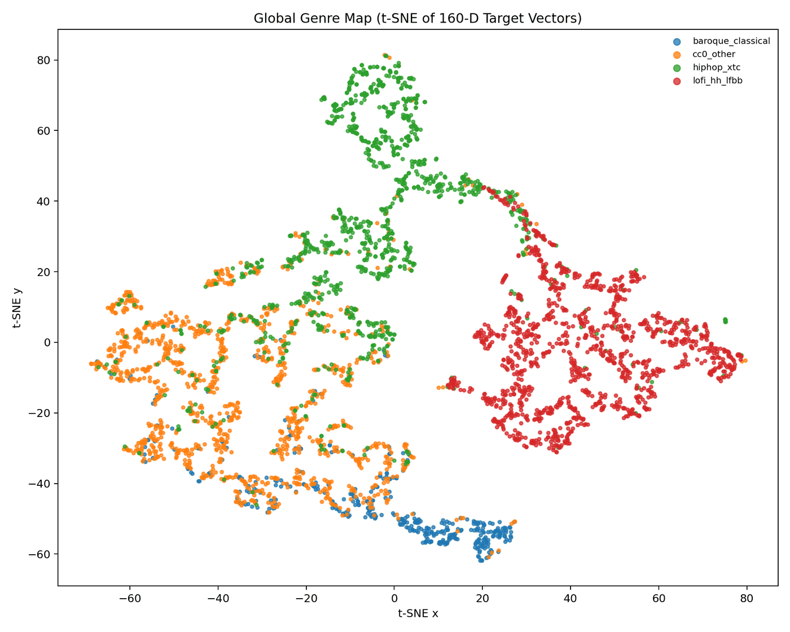

# Lab 2: Target Vector Space (Explanation)

## Goal

Turn the frozen Lab 1 style encoder into a calibrated target-style “blueprint space” suitable for conditioning downstream generation.

## Target vector definition (implemented)

Each sample produces:
- `z_style` (128D) from Lab 1
- `descriptor32` (32D) computed from the log-mel:
  - pick 16 mel bands, compute mean and standard deviation over time
  - concatenate means+stds, z-normalize per vector

Compose:
- `target160 = normalize([alpha * z_style || beta * descriptor32])`

Rationale:
- `z_style` captures learned style semantics
- `descriptor32` improves robustness to domain shifts by anchoring simple spectral texture statistics

## Centroids and validation

We compute per-genre centroids with inlier filtering (top fraction by cosine distance to the provisional centroid) to avoid outlier drift.

We validate:
- silhouette score in the target space (cosine)
- nearest centroid assignment accuracy
- linear probe accuracy
- centroid stability under bootstrap subsampling

t-SNE of the target vectors, coloured by genre. `baroque_classical` and `lofi_hh_lfbb` separate
cleanly; `hiphop_xtc` and `cc0_other` overlap heavily, which is the `cc0_other` bucket behaving as a
catch-all rather than as a genre.

See `docs/explanation/results.md` for the achieved values.

